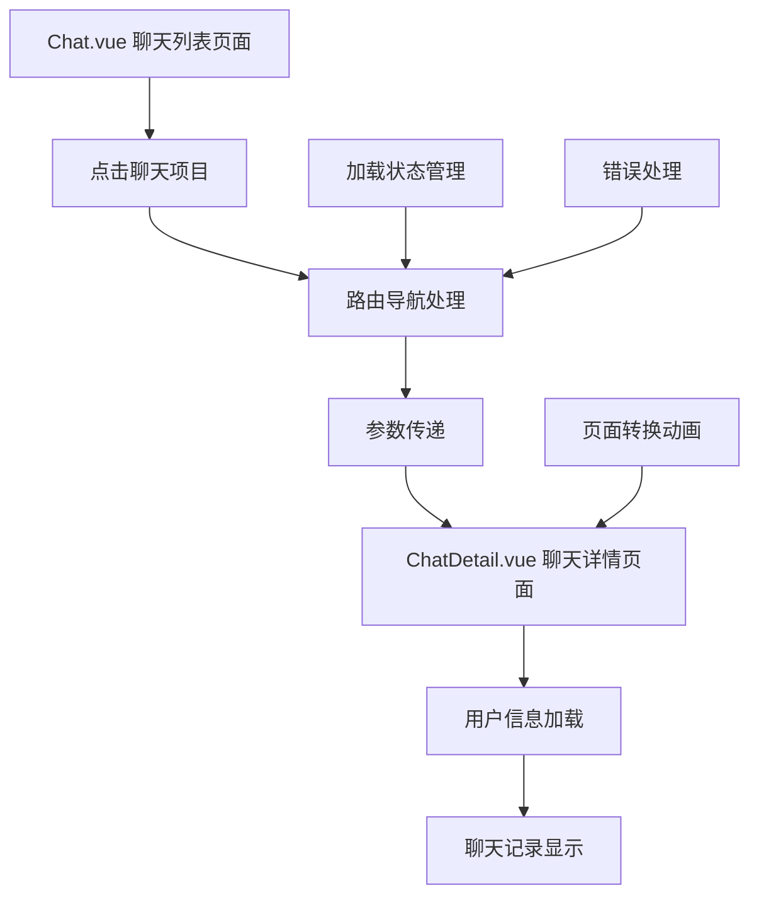

# 设计文档

## 概述

聊天导航功能设计旨在为用户提供从聊天列表页面到个人聊天详情页面的无缝导航体验。该功能将增强现有的Chat.vue组件中的点击交互，并优化与ChatDetail.vue组件的数据传递和页面转换。

## 架构

### 系统架构图



### 组件关系

- **Chat.vue**: 聊天列表页面，包含聊天项目的点击处理
- **ChatDetail.vue**: 聊天详情页面，接收用户参数并显示聊天内容
- **Router**: Vue Router处理页面导航和参数传递
- **Loading组件**: 可选的加载状态指示器

## 组件和接口

### Chat.vue 组件增强

#### 现有功能分析
- 已有`openChat(chatId)`方法处理点击事件
- 已有聊天列表数据结构
- 已有基本的路由导航逻辑

#### 需要增强的功能

**1. 点击事件处理优化**
```javascript
const openChat = (chatId) => {
  // 防止重复点击
  if (isNavigating.value) return
  
  // 设置导航状态
  isNavigating.value = true
  
  // 获取聊天用户信息
  const chatUser = chatList.value.find(chat => chat.id === chatId)
  
  // 构建导航参数
  const params = { userId: chatId }
  const query = {
    name: chatUser.name,
    avatar: chatUser.avatar,
    isOnline: chatUser.isOnline
  }
  
  // 执行导航
  router.push({ 
    name: 'ChatDetail', 
    params, 
    query 
  }).finally(() => {
    isNavigating.value = false
  })
}
```

**2. 加载状态管理**
```javascript
const isNavigating = ref(false)
const navigationError = ref(null)
```

**3. 视觉反馈增强**
- 点击高亮效果
- 加载指示器
- 错误提示

### ChatDetail.vue 组件增强

#### 现有功能分析
- 已有基本的用户信息显示
- 已有消息列表结构
- 已有返回导航功能

#### 需要增强的功能

**1. 参数接收和处理**
```javascript
const loadChatUser = () => {
  const userId = route.params.userId
  const userName = route.query.name || '用户'
  const userAvatar = route.query.avatar
  const isOnline = route.query.isOnline === 'true'
  
  chatUser.value = {
    id: userId,
    name: userName,
    avatar: userAvatar,
    isOnline: isOnline,
    description: '他刚来ME不久，还是一个小萌新',
    interests: '视频聊、健身达人'
  }
}
```

**2. 页面转换动画**
- 进入动画：从右侧滑入
- 退出动画：向右侧滑出
- 加载状态显示

### 路由配置

#### 现有路由分析
```javascript
{
  path: '/chat/:userId',
  name: 'ChatDetail',
  component: () => import('../views/ChatDetailSimple.vue'),
  meta: {
    title: '聊天详情',
    transition: 'slide-left'
  }
}
```

#### 路由增强
- 参数验证
- 错误处理
- 转换动画配置

## 数据模型

### 聊天用户数据模型
```typescript
interface ChatUser {
  id: number | string
  name: string
  avatar: string
  lastMessage: string
  time: string
  unreadCount: number
  isOnline: boolean
}
```

### 导航参数模型
```typescript
interface NavigationParams {
  userId: string
}

interface NavigationQuery {
  name: string
  avatar: string
  isOnline: string
}
```

### 导航状态模型
```typescript
interface NavigationState {
  isNavigating: boolean
  error: string | null
  loadingProgress: number
}
```

## 错误处理

### 错误类型定义

1. **导航错误**
   - 路由不存在
   - 参数缺失
   - 权限不足

2. **数据加载错误**
   - 用户信息获取失败
   - 聊天记录加载失败
   - 网络连接问题

3. **用户交互错误**
   - 重复点击
   - 无效操作
   - 超时处理

### 错误处理策略

```javascript
const handleNavigationError = (error) => {
  console.error('导航错误:', error)
  
  // 显示用户友好的错误提示
  showToast({
    type: 'error',
    message: '无法打开聊天，请稍后重试'
  })
  
  // 重置导航状态
  isNavigating.value = false
  
  // 记录错误日志
  logError('navigation_error', error)
}
```

## 测试策略

### 单元测试

1. **Chat.vue 测试**
   - 点击事件处理
   - 导航参数构建
   - 状态管理

2. **ChatDetail.vue 测试**
   - 参数接收
   - 用户信息显示
   - 返回导航

### 集成测试

1. **导航流程测试**
   - 完整的导航流程
   - 参数传递正确性
   - 页面状态同步

2. **错误场景测试**
   - 无效参数处理
   - 网络错误处理
   - 重复点击处理

### 用户体验测试

1. **性能测试**
   - 导航响应时间
   - 页面加载速度
   - 动画流畅性

2. **交互测试**
   - 点击区域大小
   - 触摸友好性
   - 视觉反馈

## 性能优化

### 导航优化

1. **预加载策略**
   - 路由组件懒加载
   - 用户数据预取
   - 图片预加载

2. **缓存策略**
   - 用户信息缓存
   - 聊天记录缓存
   - 路由状态缓存

### 动画优化

1. **CSS动画**
   - 使用transform替代position
   - 启用硬件加速
   - 优化动画时长

2. **JavaScript动画**
   - 使用requestAnimationFrame
   - 避免强制重排
   - 合理使用will-change

## 移动端适配

### 触摸交互

1. **点击区域优化**
   - 最小44px触摸目标
   - 合理的间距设计
   - 防误触处理

2. **手势支持**
   - 滑动返回
   - 长按菜单
   - 双击操作

### 响应式设计

1. **布局适配**
   - 弹性布局
   - 相对单位使用
   - 断点设计

2. **性能优化**
   - 减少重绘重排
   - 优化图片加载
   - 合理使用GPU加速

## 安全考虑

### 参数验证

1. **输入验证**
   - 用户ID格式验证
   - 参数长度限制
   - 特殊字符过滤

2. **权限检查**
   - 聊天权限验证
   - 用户状态检查
   - 访问控制

### 数据保护

1. **敏感信息处理**
   - 避免URL中传递敏感数据
   - 加密传输
   - 安全存储

2. **XSS防护**
   - 输入内容转义
   - CSP策略
   - 安全的DOM操作